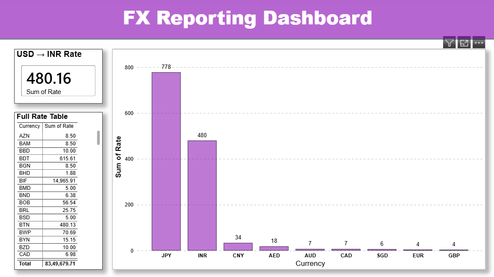

# Automated Reporting Pipeline with API Integration

Automated data pipeline that pulls live currency exchange rates via REST API, transforms raw JSON into structured datasets, and powers a self-refreshing Power BI dashboard — with error logging for root-cause tracking on pull failures.

## What it does
- Pulls live exchange rates from exchangerate-api.com (free tier)
- Scheduled daily via Windows Task Scheduler
- Transforms raw JSON responses into a clean CSV (Date, Currency, Rate)
- Logs errors (timeouts, connection issues, bad API responses) for root-cause tracking
- Powers a Power BI dashboard (bar chart, KPI card, table) that refreshes from the pipeline's output

## Tech Used
- Python (requests, json, csv, logging)
- Windows Task Scheduler (automation)
- Power BI Desktop (visualization)
- exchangerate-api.com (REST API)

## Resume Bullets This Supports
- Built an automated data pipeline pulling live data via REST API, scheduling recurring pulls using Python, and transforming raw JSON responses into structured datasets.
- Connected the pipeline to a self-refreshing Power BI dashboard, reducing manual reporting effort and supporting root-cause tracking for data pull failures.

## How to Run
1. Get a free API key from exchangerate-api.com
2. Create `config.py` with: `API_KEY = "your_key_here"`
3. Install dependencies: `pip install requests`
4. Run `python fetch_rates.py` to pull data
5. Run `python transform_data.py` to build the clean CSV
6. Open `data/clean_rates.csv` in Power BI Desktop and build/refresh the dashboard

## Dashboard

